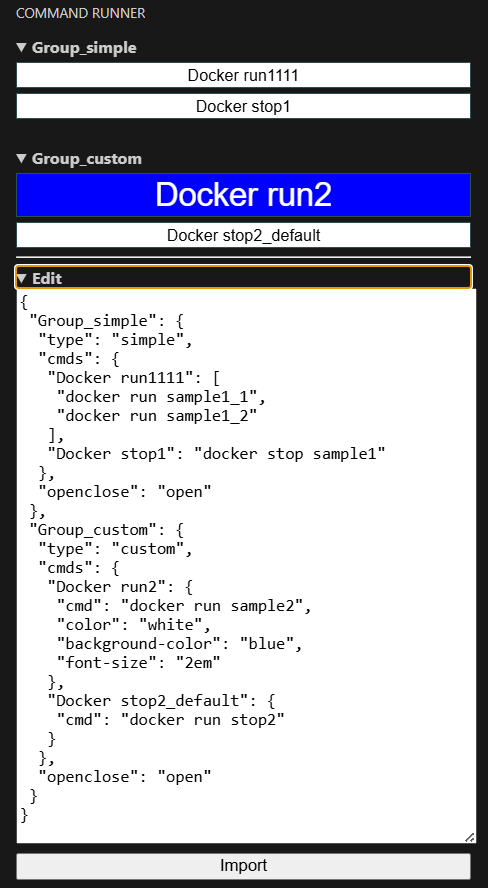

# Command Runner README

## Features

Adds a button that executes a command in the currently open terminal.
You can edit the group, display name, and command to execute in JSON as shown below. Press the Import button to reflect the edits.

## Requirements

Nothing.

## Extension Settings

Nothing.

## Known Issues

Calling out known issues can help limit users opening duplicate issues against your extension.

## Release Notes

Users appreciate release notes as you update your extension.

### 0.0.1

Create.

---

## Following extension guidelines

TODO

## Working with Markdown

TODO

## For more information

TODO
